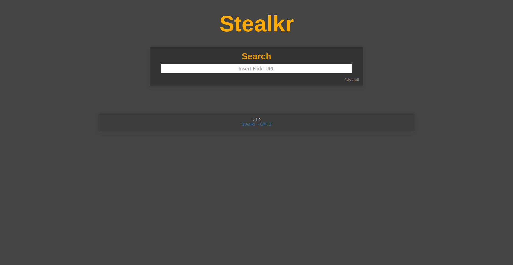

# Side-Stealkr 

[](https://www.php.net/)
 


The purpose of that website was to aim a website to simply download Flickr image. So I did it 🐻



## Getting Started

These instructions will get you a copy of the project up and running on your local machine for development and testing purposes. See deployment for notes on how to deploy the project on a live system.

### Prerequisites

All you need to have is a server (localhost, shared hosting, or beautiful VPS) with [PHP](https://www.php.net/downloads.php) (any version) running and [libcurl](https://curl.haxx.se/) ([v.7.10.5](https://www.php.net/manual/en/curl.requirements.php) or later) on it.

Except if you're running a very light VPS and you removed everything, you should have it all so do not mind about that part 🙈🙈🙈

### Installing

If you have all the prerequisites done, you've installed it all 👏👏👏

## Deployment

All this folder is ready to deploy, there is no installing procedure but if you need it...

### On localhost

Open a terminal and start to clone the repo

```
git clone https://github.com/RoiArthurB/Side-Stealkr.git
```

And start a PHP local server from that folder

```
cd ./Side-Stealkr
php -S localhost:8080
```

Now go to [http://localhost:8080](http://localhost:8080) and enjoy Stealkr 🐻

### On any web server

Download the project (with Github Zip or by cloning it)

```
git clone https://github.com/RoiArthurB/Side-Stealkr.git
```

Now drag-n-drop the whole folder in your server (with FileZilla or whatever you like).

You can simply go on your website at the corresponding location and just enjoy Stealkr 🐻

## Built With

* [PHP](https://www.php.net/) - The best language ever created 😘
* [cURL - libcurl](https://curl.haxx.se/) - command lines or scripts to transfer data
* [❤️❤️❤️](https://www.youtube.com/watch?v=HEXWRTEbj1I) - A little bit of love

## Authors

* **Arthur Brugiere** - *Initial work* - [RoiArthurB](https://github.com/RoiArthurB)

## License

This project is licensed under the GPL3 License - see the [LICENSE.md](LICENSE.md) file for details

